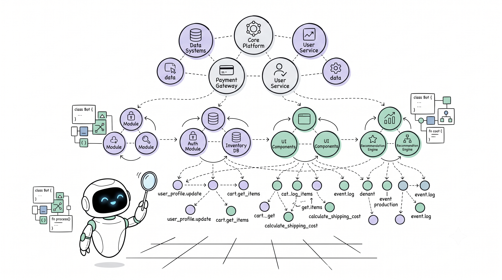
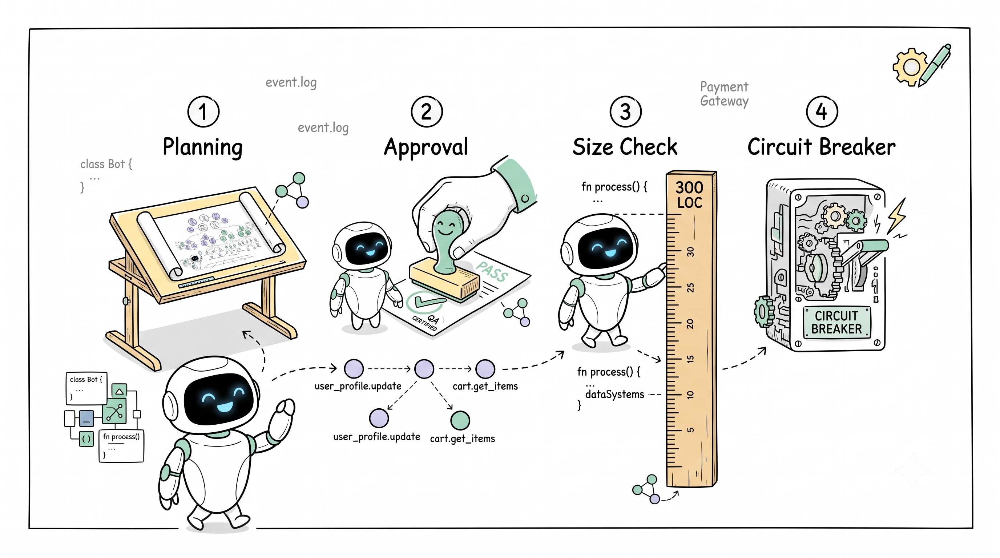
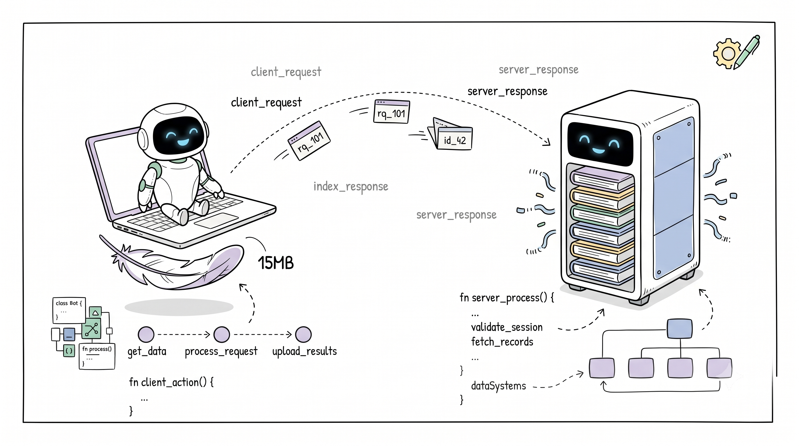

# 🦀 Agent Guidance MCP Server

[](Cargo.toml)
[](https://www.rust-lang.org/)
[](LICENSE)
[](SECURITY.md)
[](CONTRIBUTING.md)
[](CODE_OF_CONDUCT.md)
[](https://modelcontextprotocol.io/)
[](#-surgical-skill-rag-slicing-token-savings)


> **The Architectural Conductor for AI Coding Agents.**
> Stop spaghetti code, cut context bloat by 80%, and supercharge agent reasoning. Agent Guidance supervises AI Coding Agents (Claude Code, Cursor, Windsurf, Devin, Codex) by enforcing architectural patterns, preventing monolithic slop with a 300 LOC cap, and delivering sub-millisecond **Hierarchical GraphRAG** with neural skill retrieval.

---

## 🚀 Quickstart & Installation

Installers provide an interactive mode selector:
- **`[1] Full Standalone`**: Single binary with in-process Candle/ORT inference (~40 MB).
- **`[2] Lightweight Client`**: Zero-ML footprint (~15 MB RAM), forwards queries to Remote Worker.
- **`[3] Dedicated Server Worker`**: Central ML worker daemon with systemd / launchd / Windows Scheduled Task.

### Automatic One-Line Install

**Windows (PowerShell):**
```powershell
powershell -ExecutionPolicy Bypass -Command "irm https://raw.githubusercontent.com/JunMystery/Agent-Guidance-Rust/main/scripts/install.ps1 | iex"
```

**Linux / macOS (Bash):**
```bash
curl -fsSL https://raw.githubusercontent.com/JunMystery/Agent-Guidance-Rust/main/scripts/install.sh | bash
```

### Manual Cargo Build

```bash
git clone https://github.com/JunMystery/Agent-Guidance-Rust.git
cd Agent-Guidance-Rust
cargo build --release
./target/release/agent-guidance --setup
```

---

## ⚡ The Difference: AI with vs. without Agent Guidance

| Challenge | Without Agent Guidance (The AI Slop Problem) | With Agent Guidance (The Disciplined Architect) |
| :--- | :--- | :--- |
| **Code Structure & Modularity** | AI writes sprawling 800–1,500 LOC monolithic files, mixing database queries directly into UI components. | **Enforced 300 LOC Hard Cap** & upfront pattern blueprints (**Clean Architecture**, **Layered**, **Package-by-Feature**). Files are decomposed from line 1. |
| **Container & File Naming** | Creates messy junk-drawer files (`utils.ts`, `services.py`, `helpers.go`). | **40 Compound Plural Suffixes Blocked** (`COMPOUND_FILE_NAME_PROHIBITED`). Every file must strictly observe Single Responsibility. |
| **Context Window & Tokens** | Dumps full files and 500-line markdown skills into prompt, exhausting context windows and triggering hallucinations. | **Surgical Section-Level RAG Slicing**: Delivers only the top 2–3 relevant sections (~350 tokens, **~80% token savings**) using Candle BERT vector ranking. |
| **Codebase Onboarding** | AI reads files sequentially, taking dozens of turns to guess relationships and losing track of dependencies. | **10-Second Hierarchical GraphRAG**: Instant macro community outline (Level 0/1/2) and 1-hop caller/callee bundling under 250 LOC. |
| **Test & Fix Cycles** | Enters infinite repair loops, repeatedly making blind edits that break adjacent modules. | **Fix Circuit Breaker**: Trips automatically after 3 consecutive failed attempts, rolling back snapshots and requesting human intervention. |
| **Deployment Topology** | Heavy local Python/ML dependencies consume 1GB+ RAM, slowing down developer laptops. | **Dual-Role Topology**: Lightweight Client runs in **~15MB RAM**, delegating heavy neural vector workloads to a dedicated Remote ML Worker. |

---

## 🧭 Instant Codebase Onboarding with Hierarchical GraphRAG

AI agents waste up to 70% of their context reading full source files just to understand function call chains. Agent Guidance implements **Hierarchical Leiden GraphRAG** backed by Tree-sitter AST symbol tables and SQLite:



### The 3-Tier Community Hierarchy
- **Level 0 (Macro Subsystems)**: Broad domain boundaries (`ui`, `domain`, `infrastructure`, `ml`).
- **Level 1 (Feature Modules)**: Logical service groups and package boundaries.
- **Level 2 (Micro Clusters)**: Tightly-coupled function and class clusters.

```text
┌─────────────────────────────────────────────────────────────────────────────┐
│ LEVEL 0: MACRO SUBSYSTEMS (Macro Architecture Layer)                        │
│   [ UI & Presentation ]        [ Domain & Logic ]        [ Infrastructure ] │
└─────────────┬───────────────────────────┬─────────────────────────┬─────────┘
              │                           │                         │
              ▼                           ▼                         ▼
┌─────────────────────────────────────────────────────────────────────────────┐
│ LEVEL 1: FEATURE MODULES (Leiden Community Clusters)                        │
│   [ Authentication Service ]   [ Billing Engine ]        [ Rusqlite Store ] │
└─────────────┬───────────────────────────────────────────────────────────────┘
              │
              ▼
┌─────────────────────────────────────────────────────────────────────────────┐
│ LEVEL 2: MICRO CALL GRAPH (AST Directed Function Nodes)                     │
│   verify_token() ──────► check_permissions() ──────► query_user()           │
└─────────────────────────────────────────────────────────────────────────────┘
```

### The 4 GraphRAG Search Modes
1. **DRIFT Search (Default)**: Dual-route search combining macro community summaries with micro AST signatures for complete structural grounding.
2. **Global Search**: High-level architectural reasoning across macro community summaries.
3. **Local Search**: Targeted symbol search with 1-hop and 2-hop DAG call/import fan-out.
4. **Subgraph Bundling (`subgraph_bundle`)**: Packs target function definition + 1-hop callers + 1-hop callees into a single token-bounded snippet (<250 LOC).

---

## 📉 Surgical Skill RAG Slicing (Token Savings)

Traditional prompt injection dumps entire 300–600 line skill files into the context window, causing prompt bloat, high costs, and attention drift. Agent Guidance splits skills by `##` headers, computes vector embeddings, and delivers only the exact 2–3 sections relevant to the active task:

```text
TRADITIONAL FULL SKILL INJECTION:
[██████████████████████████████████████████████████] ~2,100 tokens (Full SKILL.md Dump)

AGENT GUIDANCE SURGICAL RAG SLICING:
[████████] ~350 tokens (Top 2-3 Vector-Ranked Sections)
═════════════════════════════════════════════════════════════════════════════
🚀 ~83.3% CONTEXT SAVED PER SKILL CALL | < 0.2ms In-Memory Binary AGV1/AGS1
```

- **In-Memory Binary Runtime (`AGV1` & `AGS1`)**: Zero disk reads or live markdown parsing during queries.
- **HTTP 304 Zero-Payload Caching**: Returns empty `304 Not Modified` when catalog ETag matches, cutting network round-trips to `<0.2 ms`.
- **Local SQLite LRU Cache**: Repeated skill selections resolve locally from disk in `<1 ms`.

---

## 🛡️ Step-by-Step AI Guardrail Pipeline

Agent Guidance forces autonomous agents to follow an enterprise engineering lifecycle:



```text
  [ User Prompt ]
         │
         ▼
┌─────────────────┐
│  task_pipeline  │ ──► Priority Gate & Architecture Pattern Detection
└────────┬────────┘
         │
         ▼
┌─────────────────┐
│   Plan Stage    │ ──► 300 LOC Upfront Decomposition Blueprint
└────────┬────────┘
         │
         ▼
┌─────────────────┐       No (Revise)
│ Human Approval? ├─────────────────────────┐
└────────┬────────┘                         │
         │ Yes                              ▼
         ▼                          ┌───────────────┐
┌─────────────────┐                 │ Ask / Revise  │
│   Build Stage   │                 └───────▲───────┘
│  workflow_gate  │ ──► 300 LOC Ceiling     │
└────────┬────────┘     Rollback Snapshot   │
         │                                  │
         ▼                                  │
┌─────────────────┐                         │
│  Test & Verify  │                         │
└────────┬────────┘                         │
         │                                  │
         ├────── Pass ────────► [ Review & Document ]
         │                                  │
         ├────── Fail (<= 3 attempts) ──────┤ (Auto Fix Loop)
         │                                  │
         └────── Fail (> 3 attempts) ───────┘ (Circuit Breaker Trips)
```

1. **Priority & Architecture Gate (`task_pipeline`)**: Mandatory first step. Detects project architecture, flags monolithic files ($\ge 200$ LOC), and generates modular blueprints.
2. **Human-in-the-Loop Plan Approval**: Code modification remains strictly locked until `plan_approved = true`.
3. **Write-Through Authorization (`workflow_gate`)**: Creates pre-edit rollback snapshots, blocks compound plural containers, and enforces the 300 LOC hard ceiling.
4. **Predictive Co-Change Sentinel**: Evaluates historical commit graphs to warn agents if coupled files or test suites were forgotten.
5. **Fix Circuit Breaker**: Automatically trips after 3 consecutive failed test attempts, halting hallucinated fix spirals.

---

## 🌐 Dual-Role Topology (v1.8.1)

Split your AI coding workloads to fit your development environment:



```text
Personal Developer Device (Client)             Remote Server (Worker Daemon)
┌───────────────────────────────────────┐      ┌───────────────────────────────────────┐
│ • ZERO Local ML & Vector Files        │      │ • SOLE CUSTODIAN of Binary Vectors:   │
│   (skills.bin & vectors.bin ABSENT)   │      │     vectors.bin & skills.bin (<1ms)   │
│ • Tree-sitter AST & Graph Engine      │      │ • Multi-Threaded Worker Pool (4x)     │
│ • Local SQLite (.agent-context/*.db)  │      │ • Candle BERT Embedder in VRAM/RAM    │
│ • File Reading & 300 LOC Diff Guards  │      │ • ONNX Cross-Encoder Reranker         │
│ • RAM Footprint: ~15 MB               │      │ • 1-N Compaction & Tombstone Engine   │
│ • Auto Task Context Forwarding        │      │ • RAM Footprint: ~600–800 MB          │
└──────────────────┬────────────────────┘      └──────────────────▲────────────────────┘
                   │                                              │
                   │ (HTTP Keep-Alive Pool / Zero-Payload 304)    │
                   ├─────────── POST /api/skills/search ──────────┤
                   ├─────────── POST /api/skills/slice ───────────┤
                   ├─────────── GET  /api/skills/stats ───────────┤
                   └─────────── GET  /health ─────────────────────┘
```

- **Lightweight Client (~15 MB RAM)**: Ideal for laptops. Runs local AST indexing and safety gates; delegates all semantic vector retrieval to the remote worker.
- **Dedicated Server Worker**: Centralizes skill storage for engineering teams, compiling staged custom skills into compacted binary matrices with atomic hot-swapping (<1ms).

---

## 💻 CLI Command Matrix

```bash
agent-guidance [OPTIONS]

Client & IDE Configuration:
  --setup                  Install and configure MCP server across all IDE clients
  --verify-setup           Verify MCP configuration paths across IDEs
  --upgrade                Download and install latest release package, update IDE configs
  --set-server <URL|local> Configure remote ML worker endpoint (or 'local' for standalone)
  --test-server            Test connection and measure ping latency to remote ML worker
  --stats, --status        Display client mode, system telemetry, and remote skill stats
  --uninstall              Remove MCP server configurations from all IDE clients

Remote Worker & Server Administration:
  --server                 Start remote ML worker daemon (default: http://127.0.0.1:11998)
  --worker-port <PORT>     Custom ML worker port (default: 11998)
  --bind <ADDR>            Network bind address (e.g. 0.0.0.0 or 127.0.0.1)
  --api-key <KEY>          Bearer authentication token for remote worker
  --setup-server           Interactive CLI setup wizard for remote ML worker & OS daemon
  --reindex-skills         Compile staging skills into in-memory binary format
  --delete-skill <NAME...> Prune 1-N skills from binary bundle and staging with tombstones

Daemon & Maintenance:
  --daemon, -d             Force start in background singleton daemon mode
  --proxy                  Force connect as client proxy to daemon; exit if no daemon
  --dashboard              Start real-time web usage dashboard at http://127.0.0.1:11997
  --port, -p <PORT>        Custom dashboard port (default: 11997, alias: --dashboard-port)
  --project <PATH>         Filter dashboard to a specific project path or name
  --prune-missing          Prune non-existent projects from usage tracking registry
  --cleanup                Auto-clean expired logs, prune dead projects, and vacuum SQLite DB
  --retention-days <N>     Retention window in days for detail logs (default: 7)
  --help, -h               Print help message
```

---

## 🛠️ MCP Tool Suite Reference

| Tool Name | Role / Action | Key Capabilities |
| :--- | :--- | :--- |
| **`task_pipeline`** | **Entrypoint Orchestrator** | CALL FIRST. Unlocks priority gate, detects architecture, injects memorized learnings, and synthesizes upfront modular blueprints (<300 LOC mandate). |
| **`select_skills`** | **Semantic Skill Loader** | Delivers vector-ranked surgical section slices (30–60 lines, ~350 tokens, ~80% token savings), records usage analytics, and injects language safety micro-rules. |
| **`workflow_gate`** | **Stage & Impact Guard** | Manages stage transitions (`Context` $\rightarrow$ `Plan` $\rightarrow$ `Build` $\rightarrow$ `Test` $\rightarrow$ `Fix` $\rightarrow$ `Review`), enforces 300 LOC hard ceiling, blocks compound plural containers, and controls fix circuit breakers. |
| **`project_context`** | **GraphRAG & AST Search** | Hierarchical Leiden GraphRAG (`drift`, `global`, `local`), Subgraph Bundling (<250 LOC definition + 1-hop callers/callees), intra-procedural data flow, AST skeletonization, and 6-phase instant cascade (<100ms). |
| **`guidance`** | **Standards & Skill Catalog** | 2-stage Candle BERT vector search + Cross-Encoder reranking over 279 embedded skills, pre-code architecture checklists, and empirical verification contracts. |
| **`session_continuity`** | **Memory & Snapshots** | Persists session memory, tracks pairwise co-changes into evolutionary git graphs, stores categorised project learnings, and generates cross-agent handoff briefs. |

---

## 📄 License

Distributed under the MIT License. See [LICENSE](LICENSE) for details.
