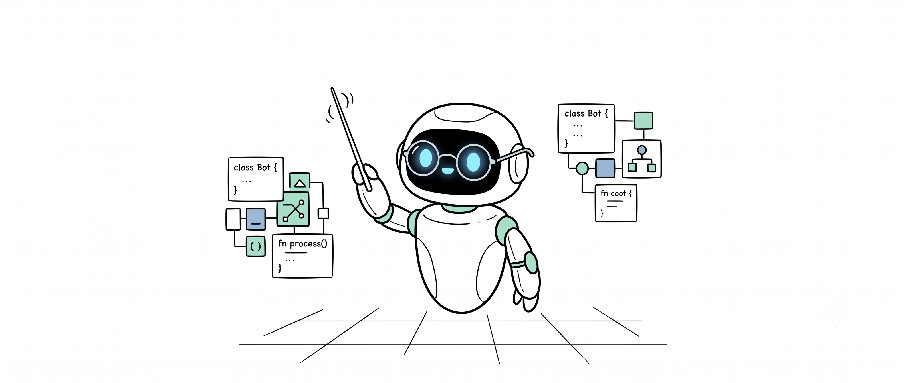
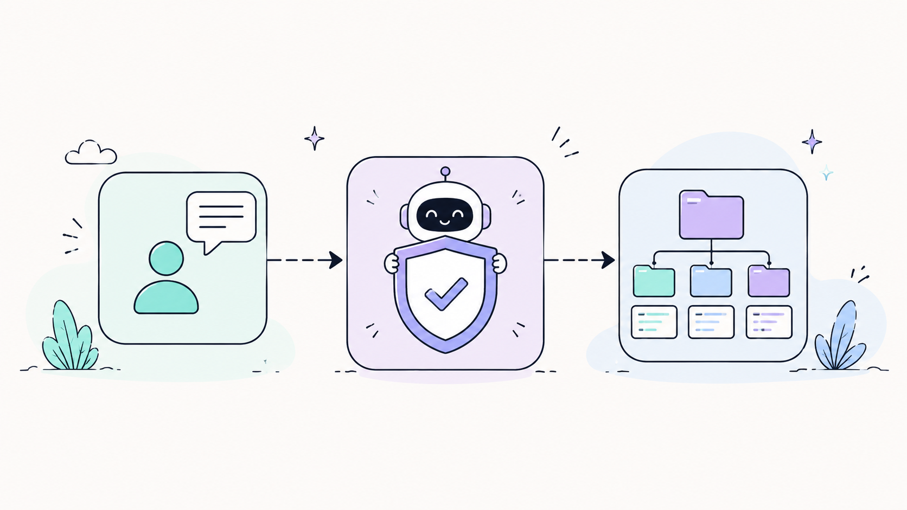

# 🦀 Agent Guidance MCP

[](Cargo.toml)
[](https://www.rust-lang.org/)
[](#-key-capabilities)
[](#-smart-skills-system)
[](#-multi-session-isolation)
[](#-universal-token-optimization)
[](https://modelcontextprotocol.io/)
[](LICENSE)



> **Agent Guidance** is a native, high-performance **MCP (Model Context Protocol) Server & Autonomous Orchestrator** written in Rust. It supervises AI Coding Agents (Antigravity, Claude Code, Cursor, Windsurf, Devin, OpenCode) to enforce enterprise architecture patterns, isolate multi-IDE session states, prevent context window blowups via token compression, and deliver sub-millisecond **Smart Skills Calls** via local ML vector search.

---

## 🚀 Quickstart & Installation

### Automatic One-Line Install (Recommended)

Run the one-liner setup script for your operating system to download the latest release binary, pre-cache local ML models, and auto-register `agent-guidance` across all detected IDE clients:

**Windows (PowerShell):**
```powershell
powershell -Command "iwr https://raw.githubusercontent.com/JunMystery/Agent-Guidance-Rust/main/scripts/install.ps1 -OutFile $env:TEMP\i.ps1; & $env:TEMP\i.ps1"
```

**Linux / macOS:**
```bash
curl -fsSL https://raw.githubusercontent.com/JunMystery/Agent-Guidance-Rust/main/scripts/install.sh | bash
```

### Manual Build via Cargo

```bash
git clone https://github.com/JunMystery/Agent-Guidance-Rust.git
cd Agent-Guidance-Rust
cargo build --release
./target/release/agent-guidance --setup
```

---

## 🛠️ MCP Tool Suite Reference

Agent Guidance exposes 6 high-efficiency MCP tools designed to minimize agent round-trips and token waste:

| Tool Name | Role / Action | Mandatory Arguments | Key Capabilities |
| :--- | :--- | :--- | :--- |
| **`task_pipeline`** | **Entrypoint Orchestrator** | `task`, `project_path`, `phase` | CALL FIRST. Scans project, unlocks priority gate, proposes skills, synthesizes **Dynamic Split Blueprints** (detects $\ge 200$ LOC files) and **Skill Recipes**, and injects **Memorized Learnings**. |
| **`select_skills`** | **Semantic Skill Loader** | `skills` | Loads skill instructions into context with **Semantic Slicing** (Top-3 sections via Multilingual-E5 saving ~70% tokens) and injects language safety micro-guidance. |
| **`workflow_gate`** | **Stage & Impact Guard** | `action` | Manages stage transitions (`check`, `status`, `set_stage`, `advance`, `authorize_edit`, `rollback`). Features **Zero-Turn Advance**, **Code Graph Impact Risk Gating**, and **Pre-edit Snapshot Rollback**. |
| **`project_context`** | **Code Graph, GraphRAG & AST Skeleton** | `operation` (`graph_rag` / `search` / `navigate` / `read` / `symbols` / `references` / `architecture` / `tree` / `learn_alias` / `reindex`) | **Hierarchical Leiden GraphRAG** (`global`, `local`, `drift`, `basic`), 5-phase cascade search (<100ms), RAG code chunk vectors, AST symbol extraction, alias learning with 30/90d decay, realtime file watcher, and **AST Structural Skeletonization** (`view_mode="skeleton"`, saving 90-95% tokens on files >300 LOC). |
| **`guidance`** | **Skills & Rule Engine** | `operation` (`search` / `docs` / `workflow` / `precode` / `verify`) | 2-stage vector search, language-specific precode safety rules (Kotlin, Go, Rust, TS, Python), and empirical verification contracts. |
| **`session_continuity`** | **Memory & Handoff** | `operation` (`save` / `load` / `clear` / `learn` / `handoff`) | Persists active task states, records **Categorized Project Learnings** in `.agent-context/learnings.md` (30-item FIFO cap), and generates **Cross-Agent Handoff** summaries in `.agent-context/handoff.md`. |

---

## 🎯 Key Capabilities

### 1. Hierarchical Codebase GraphRAG (Global, Local, DRIFT Search)
- **Leiden Hierarchical Community Clustering**: Partitions codebase symbols and AST relationships into Level 0 (Macro Subsystems), Level 1 (Feature Modules), and Level 2 (Micro Clusters).
- **The 4 Query Modes**:
  - **Global Search**: High-level reasoning across community summaries.
  - **Local Search**: Targeted symbol search with 1-hop & 2-hop DAG call/import fan-out.
  - **DRIFT Search**: Dual-route combining macro community layer context with micro AST signatures.
  - **Basic Search**: Fast HNSW vector and FTS5 fallback.
- **Continuous Reactive Watcher**: Background file watcher automatically updates AST nodes and re-clusters community summaries upon code modifications.

### 2. Autonomous Single-Entrypoint Orchestration
- Governs the complete AI agent lifecycle through `task_pipeline`. The MCP server inspects the workspace, unlocks priority gates, selects skills, and dynamically directs next steps.
- Enforces enterprise architecture styles (**Clean Architecture**, **Layered Architecture**, **Package-by-Feature**, **CLI Pipeline**, **Flat Library**, **Orchestrator**) with cross-session persistence in `.agent-context/architecture.json`.

### 3. High-Speed 5-Phase Search Cascade (<100ms)
- Replaces slow raw disk scans with an instant multi-tier cascade stored in `<project_root>/.agent-context/code_graph.db`:
  1. **Phase 1: Alias Cache (<1ms)**: Instant lookup for learned natural language queries.
  2. **Phase 2: Symbol FTS5 (<5ms)**: SQLite FTS5 index on all functions, structs, enums, classes, and traits.
  3. **Phase 3: Symbol Vectors (<50ms)**: BERT semantic similarity on symbol signatures.
  4. **Phase 4: Content FTS5 (<5ms)**: Full-text search across 50-line code chunks.
  5. **Phase 5: RAG Content Vectors (<100ms)**: Multilingual-E5 semantic search on actual code chunks.
- **Adaptive Alias Learning**: Automatically learns successful queries, increasing confidence with reuse and decaying inactive mappings (50% reduction after 30 days, purged after 90 days).
- **Proactive Background File Watcher**: Uses OS-level file monitoring (`notify`) with a 5s debounce to incrementally update AST symbols, DAG edges, and RAG chunks before the agent even issues a query.

### 3. Hardened 300 LOC Cap & Upfront Decomposition
- Physically clamps file reads at 300 lines max and automatically injects architectural decomposition mandates on large files.
- Generates concrete Upfront Split Blueprints per pattern during pre-code guidance.

### 4. Universal In-Engine Token Compression
- Automatically intercepts and compresses all outgoing MCP tool responses, stripping HTML comments, badges, and redundant whitespace.
- Reduces context payload size by **30–50%** while logging real-time token savings to SQLite (`~/.agent-guidance/usage.db`).

### 5. Multi-Session & Multi-IDE Isolation
- Assigns process-isolated Session IDs (`session_{PID}_{ClientName}`) to eliminate state collisions across concurrent IDEs (VS Code, Cursor, Antigravity) or CLI tools in the same codebase.

---

## 🏗️ Architectural Workflow



### The 7-Stage Workflow Gate
`Context` $\longrightarrow$ `Plan` $\longrightarrow$ `Ask_Revise` $\longrightarrow$ `Build` $\longrightarrow$ `Test_Recheck` $\longrightarrow$ `Fix` $\longrightarrow$ `Proposal`

- **Composite Gate Action (`workflow_gate action="advance"`)**: Performs stage check, transition, and architecture pattern authorization in a single composite MCP call.
- **Hard Edit Gate (`workflow_gate action="authorize_edit"`)**: Code modification is BLOCKED until `plan_approved = true` and a valid `architecture_pattern` is verified.
- **Circuit Breaker**: If 3 consecutive fix attempts fail during `Fix`, the MCP server automatically trips, resets stage to `Ask_Revise`, and requests human intervention.

---

## 🧠 Smart Skills System

The built-in ML catalog engine leverages local Rust bindings for Hugging Face `candle` to perform sub-millisecond semantic skill discovery:

- **Stage 1 (Cosine Similarity)**: Scans 279+ skills using Candle BERT vector embeddings with precomputed binary vector acceleration ($<5\text{ ms}$).
- **Stage 2 (Intent Reranking)**: Cross-encoder (`ms-marco-MiniLM-L-6-v2`) reranks top candidates with language profile boosting.
- **On-Demand Loading**: Skills are injected dynamically into context via `select_skills(skills=[...])` only when confirmed.

### Custom Skill Sets (User Extensibility)
You can easily add your own custom skills without rebuilding or reconfiguring the MCP server:
- **Global Custom Skills**: Simply copy or paste your skill directories/markdown files directly into:
  - **`~/.agent-guidance/skills/`** (or `~/.agents/skills/`)
- **Workspace-Specific Skills**: Place custom skills directly in your active project repository under:
  - **`<project_root>/.agents/skills/`**
  - **`<project_root>/.opencode/skills/`**
  - **`<project_root>/.claude/skills/`**

All `.md` files in these directories are automatically scanned, parsed for YAML frontmatter (`name: ...`), and indexed into the local search catalog on the fly.

---

## ⚡ Universal Token Optimization

- **Hard Clamping**: Capped at 300 LOC per file read, 20 results per search, 30 references per symbol search, and 15 items per tree preview.
- **Symbol-Targeted Extraction**: Extract exact function/struct blocks using `project_context(operation="read", target_symbol="...")` saving up to 85% of tokens.
- **Dynamic Compression**: Automatic stripping of markdown comments, badges, and empty lines across all responses.
- **SQLite Analytics**: All tool metrics, durations, and token savings are logged to `~/.agent-guidance/usage.db`.

---

## 🔒 Multi-Session Isolation

When running multiple AI agents across different IDEs or terminals simultaneously in the same repository, `Agent Guidance` maintains total isolation:

```text
.agent-context/
├── architecture.json                    (Persistent Architecture Memory)
├── sessions/
│   ├── session_14820_antigravity.json   (Build Stage - Plan Approved)
│   ├── session_29401_cursor.json        (Plan Stage - Awaiting Approval)
│   └── session_8812_cli.json            (Context Stage)
└── session.json                         (Legacy Atomic Pointer)
```

- **Automated GC Policy**: On startup and session load, stale session files older than 30 days are automatically purged. If total session files exceed 100, the oldest files are pruned.

---

## 💻 CLI Commands & Maintenance

`agent-guidance` provides built-in CLI commands for managing IDE clients, updates, and metrics:

```bash
agent-guidance [OPTIONS]

Options:
  --setup             Install and configure MCP server across all IDE clients
  --verify-setup      Verify MCP configuration paths in all IDE clients
  --upgrade           Download and install latest release package, update IDE configs
  --self-update       Alias for --upgrade
  --dashboard         Start real-time web usage dashboard at http://127.0.0.1:3000
  --uninstall         Remove MCP server configurations from all IDE clients
  --help, -h          Print help message
```

---

## 📚 Documentation Index

Comprehensive guides, architecture deep-dives, and client setup instructions are available in the [`docs/`](docs/) directory:

| Section | Topic | Documentation Link |
| :--- | :--- | :--- |
| **Architecture** | System Design & Lifecycles | [`docs/ARCHITECTURE.md`](docs/ARCHITECTURE.md) |
| **Getting Started** | Quickstart & Overview | [`docs/getting-started.md`](docs/getting-started.md) |
| **Installation** | Platform Setup & Upgrades | [`docs/installation.md`](docs/installation.md) |
| **Usage Guide** | Orchestrator & Workflow Usage | [`docs/usage.md`](docs/usage.md) |
| **Development** | Contributing & Testing | [`docs/development.md`](docs/development.md) |
| **IDE Setup** | Antigravity, Cursor, VS Code, Windsurf | [`docs/setup/`](docs/setup/) |
| **Skills Guide** | Skill Anatomy & Catalog Policy | [`docs/skills/SKILLS_OVERVIEW.md`](docs/skills/SKILLS_OVERVIEW.md) |
| **Reference** | MCP Surface & Protocol Spec | [`docs/reference/mcp-surface.md`](docs/reference/mcp-surface.md) |

---

## 🙏 Credits & Acknowledgments

This project references and acknowledges the following third-party security resources:

| Resource | Description | Repository |
| :--- | :--- | :--- |
| **ECC** | Elliptic Curve Cryptography reference implementation | [affaan-m/ECC](https://github.com/affaan-m/ECC) |
| **OWASP CheatSheetSeries** | Collection of high-value security cheat sheets for application security | [OWASP/CheatSheetSeries](https://github.com/OWASP/CheatSheetSeries) |

---

## 📄 License

Distributed under the MIT License. See [LICENSE](LICENSE) for details.
