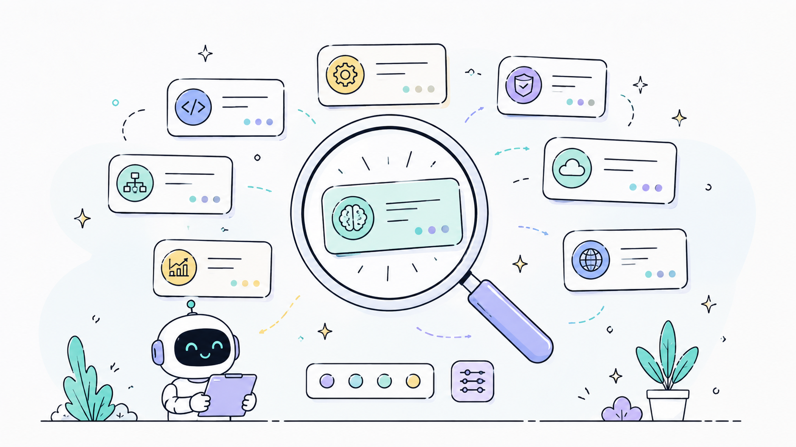

# Agent Guidance (Rust MCP Server)

[](Cargo.toml)
[](https://www.rust-lang.org/)
[](#-core-purpose--system-architecture)
[](#-smart-skills-system)
[](#-multi-session-isolation--session-gc)
[](https://modelcontextprotocol.io/)
[](LICENSE)


> **Agent Guidance** is a native, high-performance **MCP (Model Context Protocol) Server & Orchestrator Manager** written in Rust. It supervises AI Coding Agents (Antigravity, Claude, Codex, Windsurf, OpenCode) to strictly enforce enterprise architecture patterns, isolate multi-IDE session states, and deliver intelligent **Smart Skills Calls** via local ML vector search.

---

## 🎯 Core Purpose & System Architecture

1. **System-Wide Agent Guidance (Orchestrator System)**:
   - Orchestrates the entire AI agent lifecycle across all operations (`task_pipeline`, `workflow_gate`, `select_skills`, `project_context`, `session_continuity`, and priority gates).
   - Serves as an active **Manager & Supervisor** enforcing architectural boundaries (**Clean Architecture**, **Layered Architecture**, **Package-by-Feature**, **Orchestrator**, or **Auto** detection) upfront across all development phases.
2. **Zero-Config Auto Architecture Detection**:
   - Features intelligent `Auto` mode: automatically inspects codebase structure to infer patterns, supporting non-IT users without technical prompt requirements.
3. **Multi-Session & Multi-IDE Isolation**:
   - Assigns process-isolated Session IDs (`session_{PID}_{ClientName}`) to eliminate state collision when running concurrent IDEs (VS Code, Cursor, Antigravity) or CLI tools (`agy`) in the same codebase.
4. **Automatic 30-Day Session Garbage Collection (GC)**:
   - Features built-in background session cleanup with a 30-day retention TTL and a 100-session LRU file cap (~150KB total disk footprint).
5. **Smart Skills Calls (Local ML Vector Search)**:
   - Features an intelligent 2-stage hybrid search engine (Candle BERT vector embeddings + Cross-Encoder reranking) to dynamically discover and route queries to over **168+ specialized skills** on-demand.

---

## 🏗️ Architectural Workflow


### The 7-Stage Workflow Gate
`Agent Guidance` governs the AI agent lifecycle through strict stage transitions:

`Context` $\longrightarrow$ `Plan` $\longrightarrow$ `Ask_Revise` $\longrightarrow$ `Build` $\longrightarrow$ `Test_Recheck` $\longrightarrow$ `Fix` $\longrightarrow$ `Proposal`

- **Composite Gate Action (`workflow_gate action="advance"`)**: Performs stage check, transition, and architecture pattern authorization in a single composite MCP call.
- **Hard Edit Gate (`workflow_gate action="authorize_edit"`)**: Code modification is BLOCKED until `plan_approved = true` and a valid `architecture_pattern` is resolved:
  - `Auto` *(Default: Auto-detects codebase pattern or defaults to Orchestrator)*
  - `Clean_Architecture`
  - `Layered_Architecture`
  - `Package_By_Feature`
  - `Orchestrator`
- **Security & Idempotency**:
  - `workflow_gate(action="check")` is strictly read-only and idempotent.
  - Agents cannot self-approve plans via fabricated tool arguments.
  - Empirical verification contract requires real test output verification (`verification_passed = false` until verified).
- **Circuit Breaker**: If 3 consecutive fix attempts fail during `Fix`, the MCP server automatically trips, resets stage to `Ask_Revise`, and requests human intervention.

---

## 🔒 Multi-Session Isolation & Session GC

When running multiple AI agents across different IDEs or terminals simultaneously in the same repository, `Agent Guidance` maintains total isolation:

```text
.agent-context/
├── sessions/
│   ├── session_14820_antigravity.json   (Build Stage - Plan Approved)
│   ├── session_29401_cursor.json        (Plan Stage - Awaiting Approval)
│   └── session_8812_cli.json            (Context Stage)
└── session.json                         (Legacy Atomic Pointer)
```

- **Isolated State Persistence**: Session state is persisted to `.agent-context/sessions/{session_id}.json`. State mutations in one IDE session do not spill over or overwrite other active sessions.
- **Automated GC Policy**: On startup and session load, stale session files older than 30 days are automatically purged. If total session files exceed 100, the oldest files are pruned.

---

## 🧠 Smart Skills System



The built-in ML catalog engine leverages local Rust bindings for Hugging Face `candle` to perform sub-millisecond semantic skill discovery:

- **Stage 1 (Cosine Similarity)**: Scans 168+ skills using Candle BERT vector embeddings.
- **Stage 2 (Intent Reranking)**: Cross-encoder reranks top candidates based on domain context.
- **On-Demand Loading**: Skills are injected dynamically into context via `select_skills(skills=[...])` only when confirmed.

---

## 🚀 Quickstart & Setup

### Automatic Installation

Run the one-liner setup script for your operating system to compile the release binary and auto-register `agent-guidance` across installed IDEs:

**Windows (PowerShell / CMD):**
```powershell
powershell -Command "iwr https://raw.githubusercontent.com/JunMystery/Agent-Guidance-Rust/main/scripts/install.ps1 -OutFile $env:TEMP\i.ps1; & $env:TEMP\i.ps1"
```

**Linux / macOS:**
```bash
curl -fsSL https://raw.githubusercontent.com/JunMystery/Agent-Guidance-Rust/main/scripts/install.sh | bash
```

### Manual Build via Cargo

```bash
git clone https://github.com/JunMystery/Agent-Guidance-Rust.git
cd Agent-Guidance-Rust
cargo build --release
```

The compiled binary will be placed at `./target/release/agent-guidance`.

---

## 🛠️ MCP Tool Suite Reference

| Tool Name | Action / Role | Mandatory Arguments | Key Features |
| :--- | :--- | :--- | :--- |
| `task_pipeline` | **Call First**: Prepares recommendations, project tree, and phase context. Resets planning state for new tasks. | `task`, `project_path`, `phase` | Auto-resets `plan_approved = false` on new plan phase. |
| `select_skills` | **Confirm Skills**: Confirms and loads requested skill markdown instructions. | `skills` | Loads selected skills from 2-stage proposals. |
| `workflow_gate` | **Manager Gate**: Manages stage transitions (`check`, `status`, `set_stage`, `advance`, `authorize_edit`). | `action` | Composite `advance`, Auto & enterprise architecture enforcement, circuit breaker. |
| `project_context` | **Bounded Context**: Reads symbol signatures and directory trees under strict LOC budgets. | `operation` (`tree` / `read` / `search`) | Symbol-targeted extraction, max 300 LOC cap. |
| `guidance` | **Smart Skills & Rules**: Executes 2-stage vector search for skills & pre-code checklists. | `operation` (`search` / `precode` / `verify`) | Empirical verification contract registration. |
| `session_continuity` | **Session State**: Saves and restores task states across agent invocations. | `operation` (`save` / `load`) | Session-isolated persistence with 30-day GC. |

---

## 📄 License

Distributed under the MIT License. See [LICENSE](LICENSE) for details.
