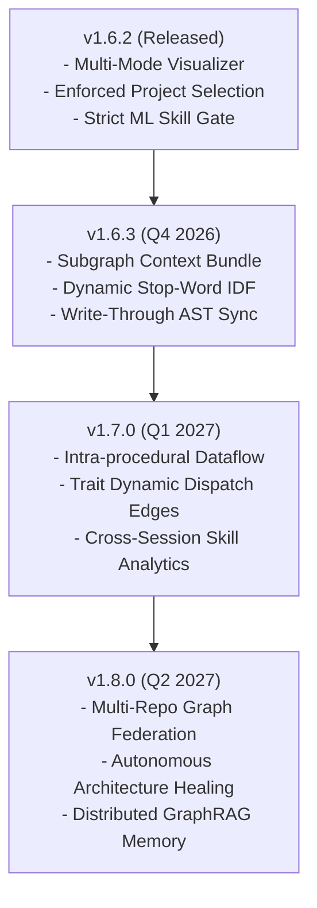

# 🗺️ Agent Guidance Roadmap & Architectural Evolution

Tài liệu này ghi nhận hiện trạng năng lực, các điểm nghẽn kỹ thuật (bottlenecks), hạn chế thực tế và lộ trình nâng cấp kiến trúc cho **Agent Guidance Rust MCP Server** cùng hệ thống **GraphRAG Code Intelligence Engine**.

---

## 🔍 Đánh Giá Năng Lực & Các Điểm Nghẽn Cần Nâng Cấp

Hệ thống GraphRAG hiện tại đạt hiệu năng cao trong việc định vị symbol đơn lẻ (< 100ms), phân tích bán kính tác động (`blast_radius`), và bảo toàn token (`view_mode="zoom"`). Tuy nhiên, qua quá trình kiểm thử thực tế và vận hành cùng các AI Agent (Antigravity, Claude, Cursor), hệ thống tồn tại 4 điểm nghẽn cốt lõi cần giải quyết:

### 1. Thiếu Multi-File Context Bundling (Điểm Nghẽn Lớn Nhất)
- **Hiện trạng**:
  - Thao tác `project_context(operation="read", view_mode="zoom")` chỉ hoạt động cục bộ trên từng file riêng lẻ.
  - Khi một tác vụ sửa lỗi hoặc tái cấu trúc trải dài trên chuỗi gọi 3–4 files (ví dụ: `Controller` $\rightarrow$ `Service` $\rightarrow$ `Repository` $\rightarrow$ `Entity`), Agent buộc phải gọi 3–4 tool calls riêng rẽ để đọc từng file.
- **Hệ quả**: Làm tăng số turn đàm thoại, gây trễ phản hồi và tăng nguy cơ trôi ngữ cảnh khi Agent phải tự chắp vá các mảnh code rời rạc.
- **Giải pháp quy hoạch**:
  - Triển khai thao tác `project_context(operation="subgraph_bundle", target_symbol="...")`.
  - Tự động gom mã nguồn của hàm mục tiêu cùng các đoạn code quan trọng của 1-hop callers và 1-hop callees vào **1 context bundle duy nhất** được nén và giới hạn chặt chẽ (< 250 LOC).

---

### 2. Giới Hạn Phân Tích AST Cú Pháp (Thiếu Data Flow & Dynamic Dispatch)
- **Hiện trạng**:
  - Bảng `symbol_edges` hiện chủ yếu dựa trên cây AST tĩnh (Tree-Sitter): phát hiện các câu lệnh gọi trực tiếp (`calls`), định nghĩa kế thừa (`implements`, `extends`) và import module (`imports`).
- **Hạn chế**:
  - Chưa truy vết được luồng dữ liệu (Data Flow / Taint Tracking): biến hoặc cấu trúc dữ liệu được sinh ra ở đâu, bị biến đổi qua các hàm nào trước khi ghi vào database/mạng.
  - Hạn chế khi gặp Dynamic Dispatch, Reflection, hoặc Dependency Injection trừu tượng không có liên kết tĩnh trực tiếp tại thời điểm biên dịch.
- **Giải pháp quy hoạch**:
  - Tích hợp bộ phân tích luồng dữ liệu tĩnh nhẹ (Lightweight Intra-procedural Dataflow) để gán nhãn `flows_into` cho các symbol.
  - Tự động nhận diện các quan hệ implement trait động để dựng các cạnh suy diễn có trọng số (`inferred_edges`).

---

### 3. Nhiễu Từ Khóa Kỹ Thuật Phổ Thông Trong Search (Lexical & Vector Overlap)
- **Hiện trạng**:
  - Đã bổ sung bộ lọc stop-words hành động (`update`, `version`, `bump`, `release`, `fix`) và nâng ngưỡng Cross-Encoder lên 0.65.
- **Hạn chế**:
  - Với các từ khóa kỹ thuật có tần suất xuất hiện dày đặc trong codebase (ví dụ: `graph`, `project`, `config`, `state`), tìm kiếm lai (Hybrid Vector + FTS5) vẫn có thể kéo theo các file tiện ích hoặc test fixtures không phải trọng tâm nghiệp vụ của truy vấn.
- **Giải pháp quy hoạch**:
  - Áp dụng kỹ thuật BM25/TF-IDF inverse document frequency (IDF) dynamic down-weighting đối với các thuật ngữ xuất hiện ở > 30% số file trong dự án.
  - Bổ sung tầng Intent Gating: phân biệt giữa truy vấn tìm kiếm code logic (`logic_intent`) và tài liệu hướng dẫn (`guidance_intent`).

---

### 4. Độ Tươi Tức Thời Của Code Graph (Incremental JIT Sync Latency)
- **Hiện trạng**:
  - Cơ chế watcher sử dụng debounce (5s) kết hợp với JIT Sync ở Turn 1 của `task_pipeline`.
- **Hạn chế**:
  - Khi Agent thực hiện nhiều chỉnh sửa liên tiếp trong cùng một phiên làm việc, nếu không kích hoạt lại `task_pipeline`, chỉ mục AST trong `code_graph.db` có thể bị trễ một nhịp so với nội dung file thực tế trên đĩa.
- **Giải pháp quy hoạch**:
  - Chuyển cơ chế file watcher sang mô hình **Write-Through Invalidation**: mỗi khi `workflow_gate(action="authorize_edit")` hoặc file tool chỉnh sửa thành công một file, lập tức đánh dấu dirty và re-index riêng file đó (< 10ms) vào SQLite mà không cần chờ debounce toàn cục.

---

## 🚀 Kế Hoạch Phiên Bản & Mốc Triển Khai (Milestones)

### 📦 v1.6.3 — Subgraph Bundling & Search Precision (Next Release)
- [ ] **`project_context(operation="subgraph_bundle")`**: Đóng gói hàm mục tiêu + 1-hop call snippets trong 1 lượt đọc duy nhất.
- [ ] **Dynamic Term Down-Weighting**: Tự động giảm trọng số các từ khóa có tần suất xuất hiện quá phổ biến trong dự án.
- [ ] **Write-Through AST Invalidation**: Cập nhật đồ thị cục bộ tức thì ngay sau mỗi lệnh ghi file thành công.

### 📦 v1.7.0 — Data Flow & Dynamic Trait Resolution
- [ ] **Lightweight Dataflow Traversal**: Truy vết nguồn gốc biến và tham số đầu vào qua chuỗi hàm.
- [ ] **Trait & Interface Implementation Links**: Tự động liên kết các hàm implement với trait definition qua `implements_method` edges.
- [ ] **Context Window Budget Manager**: Thuật toán tự động căn chỉnh số lượng callers/callees sao cho không bao giờ vượt quá ngân sách token yêu cầu.

### 📦 v1.8.0 — Deep Graph Federation & Distributed Memory
- [ ] **Multi-Workspace Linked Graph**: Khả năng nhảy symbol và tìm kiếm xuyên suốt nhiều Git repository liên kết trong cùng một tổ chức.
- [ ] **Continuous Learning Graph**: Đồ thị tự học hỏi từ các session sửa lỗi thành công trong quá khứ để gợi ý các file liên đới hay bị bỏ quên.
