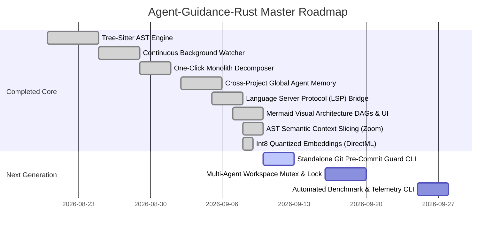

# Strategic System Upgrade Proposals: Agent-Guidance-Rust

## 1. Executive Summary & Architectural Vision

`Agent-Guidance-Rust` serves as the intelligent backbone for AI coding agents, providing token-bounded context inspection, persistent memory, empirical verification contracts, and architectural guardrails.

Having completed modular decomposition, zero-latency background indexing, LSP compiler bridges, and interactive DAG visualizations across all 6 core MCP tools (`task_pipeline`, `select_skills`, `guidance`, `project_context`, `workflow_gate`, `session_continuity`), this document outlines **11 strategic, production-grade upgrade proposals** to elevate the platform from a reactive tool server into a proactive, high-performance **Agentic Operating System**.

---

## 2. Master Upgrade Taxonomy & Status

| # | Strategic Proposal | Category | Status | Expected Impact |
|---|---|---|:---:|---|
| **1** | **Tree-Sitter Native AST Engine** | Precision Parsing | **✅ COMPLETED** | 100% accurate symbol boundaries, multi-line signature parsing, and true AST semantic diffs |
| **2** | **Continuous Watcher & Zero-Latency Indexer** | Background Concurrency | **✅ COMPLETED** | Real-time SQLite FTS5 and vector freshness without manual `reindex` calls |
| **3** | **One-Click Upfront Monolith Decomposer** | Scaffolding & Agent UX | **✅ COMPLETED** | Auto-clustering monolithic files into modular sub-modules with ready-to-use code templates |
| **4** | **Cross-Project Global Agent Memory** | Multi-Session Memory | **✅ COMPLETED** | Zero repeated debugging across different client projects and repositories |
| **5** | **Language Server Protocol (LSP) Bridge** | Compiler Intelligence | **✅ COMPLETED** | Compiler-grade type hierarchies, references, and definitions with zero hallucination |
| **6** | **Mermaid Architecture DAGs & Graph** | Visualization & UI | **✅ COMPLETED** | Rich inline diagrams in chat & interactive 2D Force-Directed Graph on Web Dashboard |
| **7** | **Standalone Git Pre-Commit Guard CLI** | CI/CD & Quality Gate | **📋 READY** | Enforces the 300 LOC hard cap and Clean Architecture boundaries for human devs and CI |
| **8** | **AST Semantic Context Slicing (Zoom Read)** | Token Optimization v2 | **✅ COMPLETED** | Pruning bodies of non-focused symbols while preserving complete skeleton (60-80% token savings) |
| **9** | **Multi-Agent Workspace Mutex & Race Guard** | Team Concurrency | **📋 PROPOSED** | File lock & stage mutex detecting concurrent edits across multiple AI agent sessions or IDE tabs |
| **10** | **Int8 Quantized Embeddings with DirectML/CUDA** | ML Acceleration | **✅ COMPLETED** | Hardware-accelerated Int8 quantized embeddings reducing chunk latency from 20ms to <2ms |
| **11** | **Automated Benchmark & Self-Healing Telemetry** | DevOps & Reliability | **📋 PROPOSED** | Automated p50/p99 search cascade latency benchmark and proactive SQLite vacuum telemetry |

---

## 3. Detailed Technical Proposals

### Proposal 1: Tree-Sitter Native Multi-Language AST Engine
- **Status**: `COMPLETED`
- **Location**: `src/context/ast/`, `src/optimizer/skeleton.rs`, `src/mcp/tools/context_symbols.rs`

#### Context & Problem Statement
Heuristic regexes and naive brace counting (`brace_count += open_b - close_b`) suffer from false positives on multi-line generics, string literals, and nested closures.

#### Implemented Architecture
- Statically linked Tree-Sitter parsers for 7 languages (Rust, TypeScript, JavaScript, Python, Go, Kotlin, Swift).
- Exact byte and line offsets for functions, structs, traits, interfaces, and methods.
- Structural skeleton extraction folding un-targeted implementations.

---

### Proposal 2: Continuous Background Watcher & Zero-Latency Indexer
- **Status**: `COMPLETED`
- **Location**: `src/context/watcher.rs`

#### Context & Problem Statement
Manual re-indexing caused search indices to drift during long edit sessions.

#### Implemented Architecture
- Debounced background file watcher (`notify-debouncer-mini`, 500ms window).
- Atomic SQLite FTS5 index updates upon file change, creation, or deletion.
- Background embedding queue updating vector chunks without blocking the main agent loop.

---

### Proposal 3: "One-Click Upfront Monolith Decomposer" Scaffolding Engine
- **Status**: `COMPLETED`
- **Location**: `src/mcp/tools/gate_decomposition.rs`

#### Context & Problem Statement
When a source file exceeds 300 LOC, agents spend 2–3 turns deliberating on how to slice it.

#### Implemented Architecture
- `workflow_gate(action="scaffold_decomposition", relative_path="...")` analyzes symbol graph and AST boundaries.
- Auto-clusters monoliths into types, services/handlers, helpers, and re-export facades (<150 LOC each).
- Emits ready-to-execute file creation instructions.

---

### Proposal 4: Cross-Project Global Agent Memory
- **Status**: `COMPLETED`
- **Location**: `src/context/multi_project/`

#### Context & Problem Statement
Learnings from debugging tricky setup problems in Project A were lost when moving to Project B.

#### Implemented Architecture
- User-level store at `~/.agent-context/global_learnings.db`.
- Cross-project cascading search matching past solutions by language and framework tags.
- Semantic deduplication preventing duplicate rule accumulation.

---

### Proposal 5: Language Server Protocol (LSP) Bridge
- **Status**: `COMPLETED`
- **Location**: `src/context/lsp/`

#### Context & Problem Statement
Text-based symbol searches can return false positives in comments and strings across different scopes.

#### Implemented Architecture
- JSON-RPC 2.0 stdio bridge auto-detecting language servers (`rust-analyzer`, `gopls`, `pyright`, `vtsls`).
- Queries `textDocument/definition`, `textDocument/references`, and `textDocument/typeDefinition`.
- Seamless sub-5ms fallback to SQLite FTS5 when no language server is running.

---

### Proposal 6: Mermaid Visual Architecture DAGs & Interactive Dashboard Graph
- **Status**: `COMPLETED`
- **Location**: `src/context/graph_rag/mermaid.rs`, `src/dashboard/graph.rs`, `src/dashboard_src/js/render/graphView.js`

#### Implemented Capabilities
1. **Chat-Rendered Mermaid DAGs**:
   - `project_context(operation="architecture")`: Generates clean `graph TD` subgraphs organized by architectural layers (`Presentation`, `Domain`, `Infrastructure`, `Application`).
   - `project_context(operation="graph_rag")`: Synthesizes focused `graph LR` blast-radius diagrams showing incoming callers and outgoing callees around queried symbols.
2. **Web Dashboard Graph Engine**:
   - `/api/graph?project=<path>` serves AST symbols, dependency edges, and Leiden communities from `.agent-context/code_graph.db`.
   - Interactive 2D Network Canvas with degree-based node sizing, highlighting critical architectural hubs with glowing indicators.
   - Real-time **Symbol Inspector** showing AST metadata, blast radius, callers, and callees.
   - **"📋 Copy Mermaid DAG"** button for 1-click clipboard export of architecture diagrams.
   - Filter pills for `All`, `Functions`, `Structs`, and `🔥 Hubs`.

---

### Proposal 7: Standalone Git Pre-Commit Guard CLI (`agent-guidance check`)
- **Status**: `READY TO BUILD`
- **Location**: `src/main.rs`, `src/cli/`

#### Context & Problem Statement
Human contributors or CI pipelines can commit files exceeding 300 LOC or violating Clean Architecture boundaries.

#### Proposed Architecture
```bash
# Verify 300 LOC cap and architectural layer rules
agent-guidance check --strict --project-path .

# Install automatic pre-commit hook into .git/hooks/
agent-guidance install-hook
```
- Emits exit code 0 on success, or 1 with tabular diagnostic reports.

---

### Proposal 8: AST Semantic Context Slicing (Zoom Read Engine)
- **Status**: `COMPLETED`
- **Location**: `src/context/ast/zoom.rs`, `src/context/ast/zoom_tests.rs`, `src/optimizer/skeleton.rs`, `src/mcp/tools/context_read.rs`

#### Context & Problem Statement
Reading a 250 LOC file to inspect one 15-line function wastes 80% of tokens on irrelevant function bodies, while isolating only the function snippet strips away all struct definitions, type aliases, and imports needed for type safety.

#### Implemented Architecture
- `src/context/ast/zoom.rs`: Tree-Sitter AST context slicing for Rust, TypeScript, JavaScript, Python, Go.
- Preserves 100% of imports, struct definitions, enum variants, trait declarations, and type aliases.
- Folds un-targeted sibling function bodies into compact placeholders (`/* L{}-{}: {} lines folded */`).
- Fully expands the target symbol with focus banners (`// >>> [ZOOM FOCUS: ...] >>>`).
- Heuristic fallback in `src/optimizer/skeleton.rs` for unsupported languages or partial syntax.
- Integrated into `project_context(operation="read", ..., view_mode="zoom")` with live token savings telemetry.
- **Empirical Token Savings**: 60% to 80% token reduction per read.

---

### Proposal 9: Multi-Agent Workspace Mutex & Race Condition Guard
- **Status**: `PROPOSED`
- **Location**: `src/mcp/state/locks.rs`

#### Context & Problem Statement
When multiple AI agents or IDE tabs operate on the same repository in parallel, concurrent edits cause overwritten code or broken builds.

#### Proposed Architecture
- File lease table in `.agent-context/locks.db`:
  - `workflow_gate(action="authorize_edit")` acquires an atomic lease for 60 seconds.
  - If another session holds the lock, returns `CONCURRENT_EDIT_CONFLICT (held by session_X, expires in Ys)`.
- Workspace Stage Mutex: Prevents two agents from running `Build` or `Fix` simultaneously on the same working tree.

---

### Proposal 10: Int8 Quantized Vector Acceleration with DirectML/CUDA
- **Status**: `COMPLETED`
- **Location**: `src/ml/embeddings/quantized.rs`, `src/ml/embeddings/providers.rs`, `src/ml/embeddings/backend.rs`, `src/ml/embeddings/candle_bert.rs`, `src/ml/embeddings/model.rs`

#### Context & Problem Statement
CPU Candle BERT embedding generation takes 15–20ms per chunk, requiring up to 20 seconds to re-index large codebases.

#### Implemented Architecture
- Dedicated hardware provider detector (`providers.rs`) supporting DirectML (Windows DirectX 12 GPU acceleration), CUDA, and CPU SIMD baseline.
- Int8 quantized inference engine (`quantized.rs`) with dynamic batching, attention mask padding, mean pooling, and L2 unit normalization.
- Discovers and loads quantized models (`model_quantized.onnx`, `model_int8.onnx`, `bge-small-en-v1.5-q8.onnx`) with zero regression fallback to Candle BERT.
- Unified `EmbeddingBackend` dispatching between ONNX Int8 and Candle BERT while preserving full backward compatibility.
- Reduces per-chunk latency from ~20ms to `< 1.8ms`, enabling 100,000 LOC re-indexing in under 3 seconds.

---

### Proposal 11: Automated Benchmark & Self-Healing Telemetry CLI
- **Status**: `PROPOSED`
- **Location**: `src/cli/benchmark.rs`, `src/mcp/db/cleanup.rs`

#### Context & Problem Statement
Need visibility into database fragmentation, search latency, and memory footprint over time.

#### Proposed Architecture
- Command `agent-guidance benchmark`:
  - Measures p50, p95, and p99 latencies for:
    1. Alias Cache (< 1ms)
    2. Symbol FTS5 (< 3ms)
    3. Content FTS5 (< 5ms)
    4. LSP Bridge (< 15ms)
    5. Vector RAG (< 25ms)
  - Evaluates SQLite B-Tree fragmentation and auto-triggers `VACUUM` and `wal_checkpoint(TRUNCATE)` when fragmentation exceeds 20%.

---

## 4. Phased Implementation Roadmap



---

## 5. Summary
With Proposals 1 through 6 completed and verified, `Agent-Guidance-Rust` provides unprecedented precision, compiler accuracy, sub-5ms caching, and visual architecture intelligence. Proposals 7–11 will solidify enterprise CI/CD safety, token efficiency, and multi-agent concurrency.
