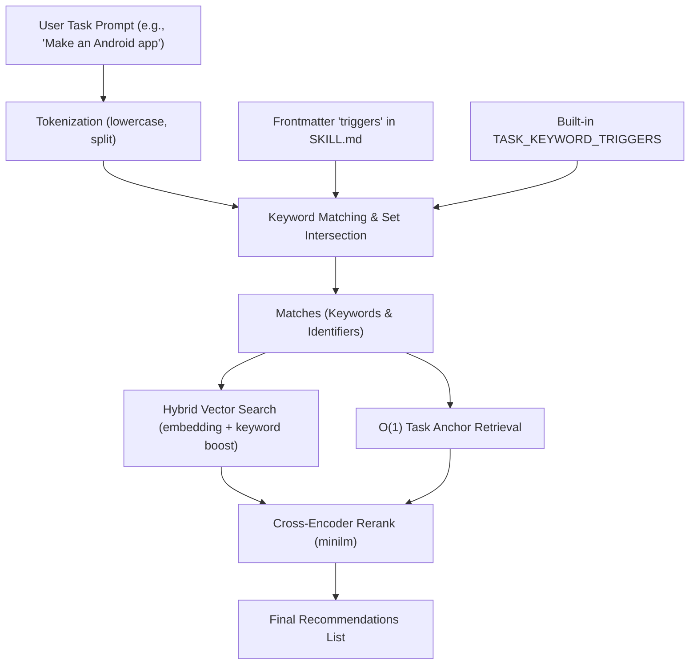

# Auto Skill Discovery Pipeline

This document describes the three-tier pipeline used by the Agent Guidance MCP server to automatically detect, classify, and match skills/guidelines for user tasks.

---

## 🏗️ Architecture Workflow



---

## ⚙️ Processing Phases

### 1. Tokenization & Normalization
* **Files**: `src/mcp/tools.rs` (keyword extraction in `hybrid_vector_search`)
* **Action**: Extracts tokens from the task string, filters out single-character words, converts to lowercase. Embedded in the hybrid search pipeline.

### 2. Flexible Keyword Inference & Root Mapping
* **File**: `src/mcp/tools.rs` & `src/ml/embeddings.rs`
* **Action**: Compares extracted task terms against skill names and content. Three matching levels:
  * **Exact Match**: skill name equals query → +0.5 score boost
  * **Name Contains**: skill name contains query → +0.3 score boost
  * **Word Match**: query word found in skill name → +0.1 score boost each

### 3. Catalog Matching & Anchor Routing
* **File**: `src/catalog/store.rs` (`load_all_skills`) & `src/mcp/tools.rs` (`task_pipeline`)
* **Action**: Loads all embedded skills + workspace-local skills. Matches keywords to pull relevant entries:
  * **Anchor Promotion**: Frontmatter `anchors` promote matching skills to top recommendations.
  * **Name/Content Keyword Scoring**: Additional weight for skills matching task keywords.

### 4. Hybrid Vector Search & Cross-Encoder Rerank
* **File**: `src/ml/embeddings.rs` (`hybrid_vector_search`) & `src/ml/llm_selector.rs` (`LLMSelector::rerank`)
* **Action**: Generates a query vector embedding via multilingual-e5-small, scores all 276 cached passage vectors by cosine similarity, then re-ranks top-8 with a cross-encoder:
  * **Cached Passage Vectors**: All skills pre-embedded during `warmup_cache()` at daemon startup — stored in `PASSAGE_CACHE` module-level `OnceLock`
  * **Hybrid Score**: `cosine_similarity(q_vec, passage_vec) + keyword_boost`
  * **Cross-Encoder Rerank**: `LLMSelector::rerank()` scores top-8 with cross-encoder/ms-marco-MiniLM-L-6-v2 (single-output regression, num_labels=1)
  * **Graceful Fallback**: If the cross-encoder fails, falls back to keyword-frequency ranking

---

## 📋 Extending Triggers in Skill Files

To register any new or existing skill in the Auto Skill Discovery pipeline, simply add frontmatter tags to the skill's `SKILL.md` file:

```yaml
---
name: my-custom-skill
description: Guidelines for custom operations
triggers: [custom, operations, modularize, modular]
anchors: [custom-anchor]
dependencies: [base-standard-identifier]
---
```
* Adding words to `triggers` will automatically feed them to the matching engine.
* Declaring `anchors` will map those keywords to this file as top-priority recommendations.
